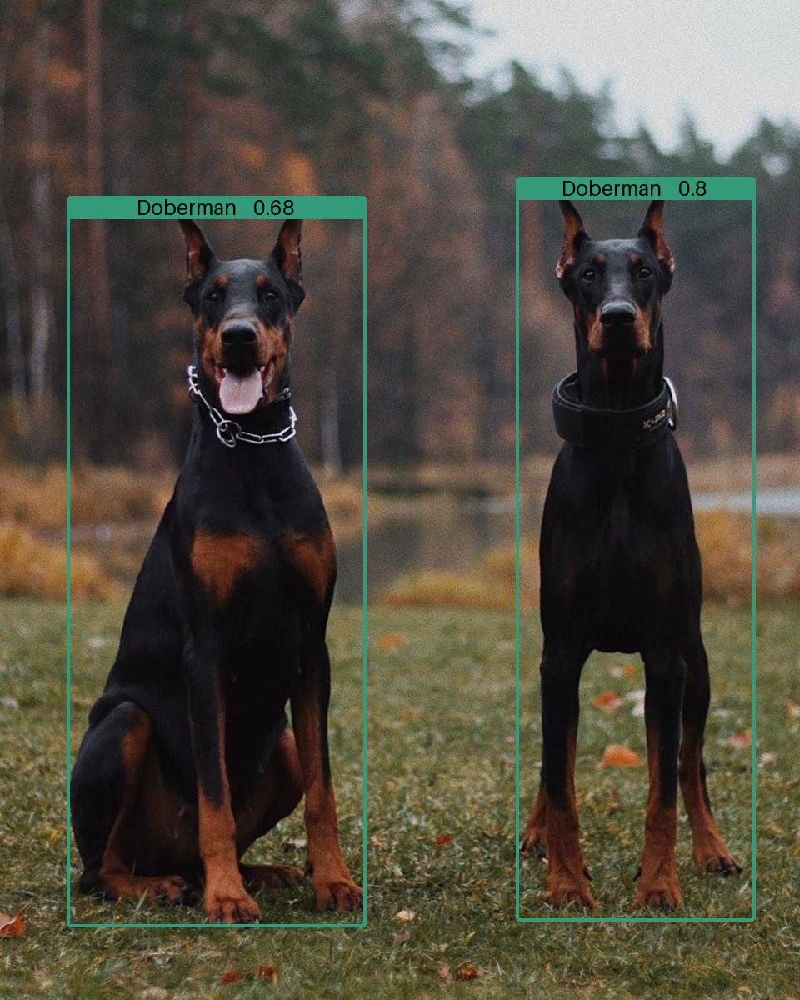
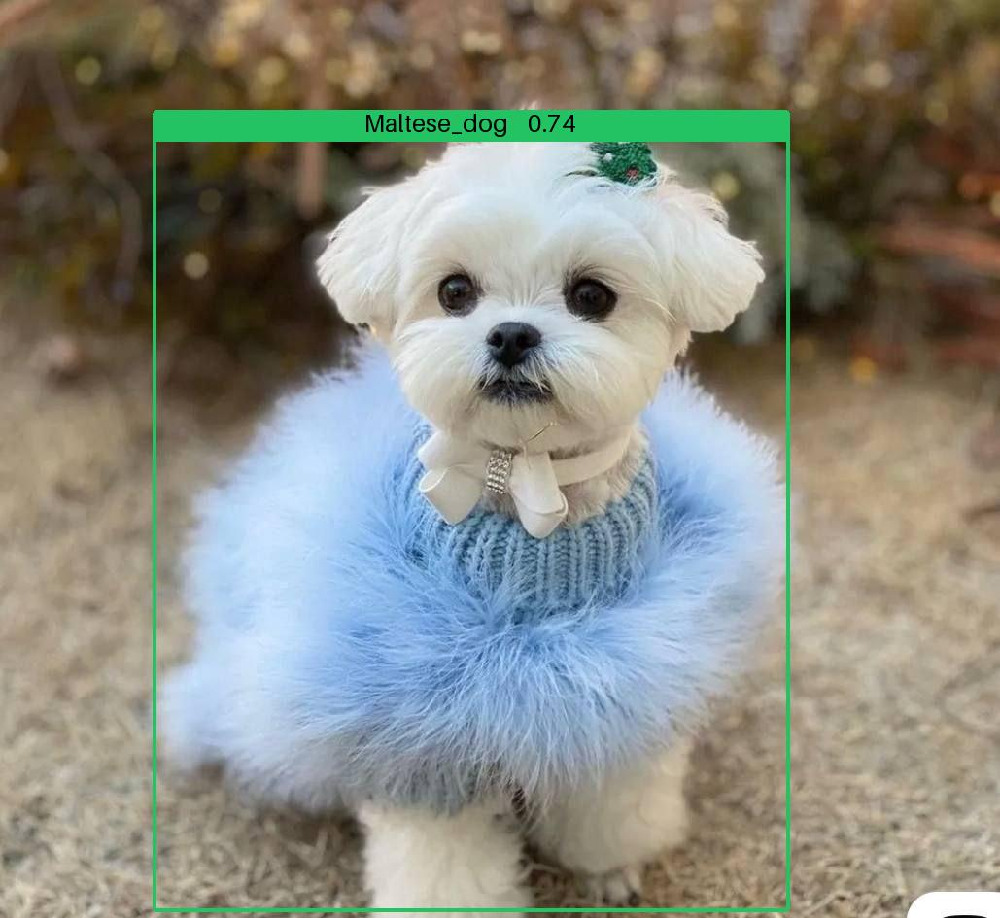
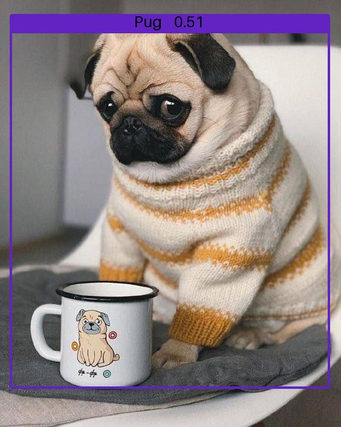

## Breeds bot 
Телеграм бот на базе *Yolov8s*, для детекции собак разных пород

### Основа
*Yolov8s* натренированная на *Stanford Dogs Dataset* ~80 эпох

Изменен процесс наложения bbox'ов, для улучшения их внешнего вида на изображениях с низким разрешением.

Дополнительно рассчитываться *IoU* и удаляются bbox'ы с высокой степенью пересечения, так как встроенный в yolo *IoU порог* работает не совсем корректно.

MAP50 на всех классах: 0.43

[Более подробные метрики](metrics/metrics.md)

### Примеры
 

Больше примеров можно посмотреть [здесь](examples)

### Включение

Вообще бот находится в выключеном состоянии, но при необходимости могу включить. Писать в [телеграмм](https://t.me/ketoruu).
